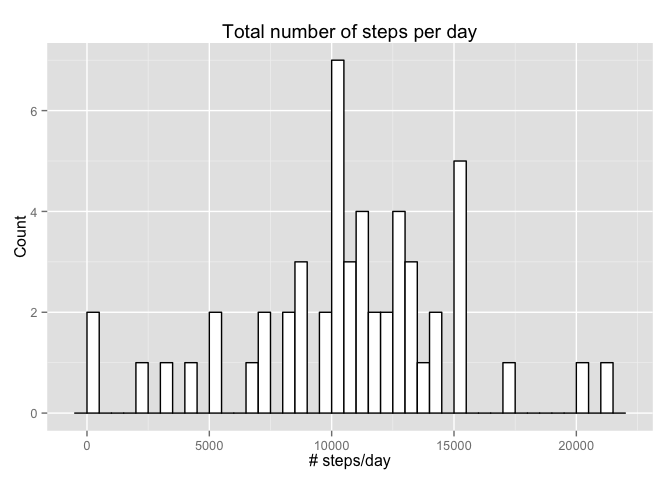
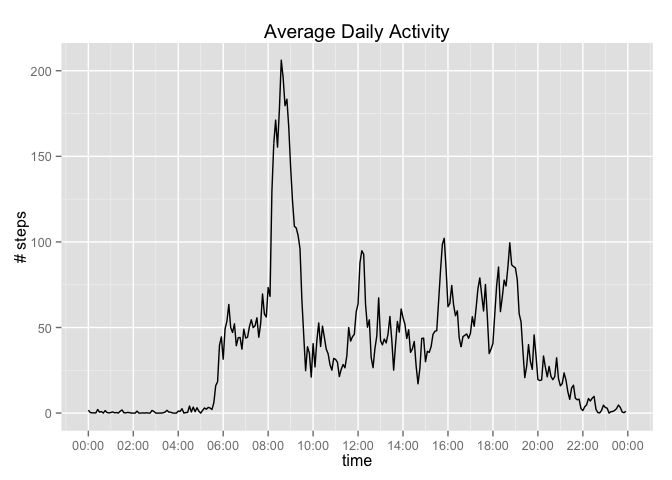
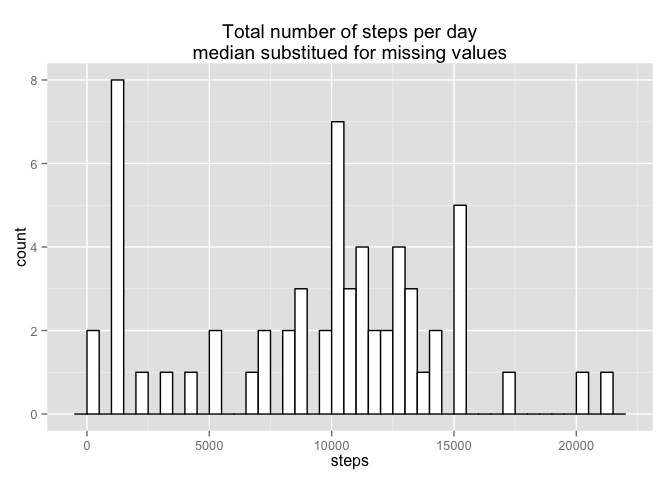
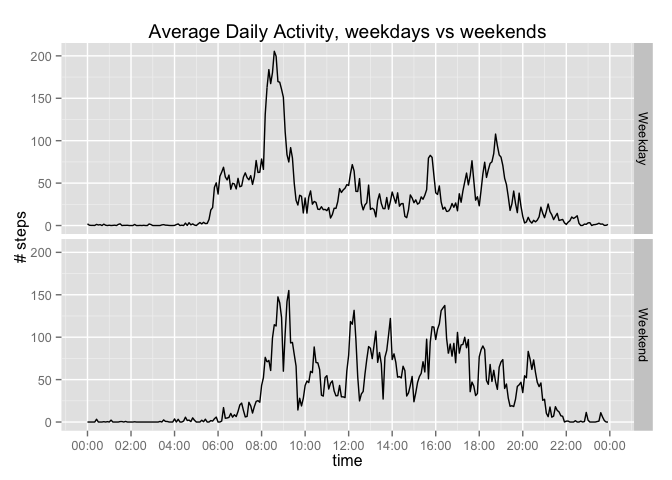

# Reproducible Research: Peer Assessment 1
S. Blackstone  
17-05-2015  


## Loading and preprocessing the data
The data have been taken from the course website in .zip format. If not already done using an appropriate stand-alone utility, the archive can be extracted with the call 

```r
   unzip("activity.zip")
```

Quick inspection of the `activity.csv` file that was extracted from the archive (by e.g. using the `less` commmand on a Unix-like system) reveals that 

* the first line contains the variable (column) names
* missing (NA) values are coded as the string "NA"
* interval is coded as a number, ranging from 0 to 2355

The `date` column will be treated as actual dates instead of strings. The `interval` column are not actual numbers, but rather indicate a 5-minute time interval. For convenience they will be treated as integer variables. 

The file `activity.csv` can now be read in using the command

```r
activity <- read.csv("activity.csv",na.strings="NA",colClasses=c("integer","Date","integer"))
```


## What is mean total number of steps taken per day?

To get an idea of the mean total number of steps taken per day, we first calculate the sum of the number of steps in all intervals for each day. These numbers are stored in a data frame `totals`. The rows with missing values are ignored in this operation.


```r
# ignore missing values => set na.rm to TRUE
totals <- aggregate(steps ~ date,data=activity, sum,na.rm=TRUE)
```

The following figure plots a histogram of the total number of steps: x-axis contains the number of steps, y-axis the number of occurrences of that number. The resolution is set to an interval size of 500 steps per bin.


```r
require('ggplot2')
ggplot(totals,aes(x=steps)) +
  geom_histogram(fill="white",colour="black",binwidth=500) +
  labs(title="Total number of steps per day",x="# steps/day",y="Count")+
  scale_y_continuous(breaks=seq(0,10,2))
```

 

As can be seen from the plot, the average number of steps per day will turn out to be around 10000 - slightly above. Or, to be more exact, the mean and median values are given in the table below.


```r
summary(totals$steps)[c("Mean","Median")]
```

```
##   Mean Median 
##  10770  10760
```

Note: numbers are rounded to the nearest whole number. Strangely enough the rounded values as calculated by the `mean()` and `median()` functions are 10766 and 10765, respectively, slightly different than the values in the `summary` overview! 

## What is the average daily activity pattern?
In order to investigate average daily activity patterns the activity data for each is first aggregated over each time interval across all dates. Subsequently the time interval with the highest activity on average can be determined.


```r
#Calculate total nr of steps in each time interval, construct a data frame from that
ints            <- aggregate(steps ~ interval,data=activity, mean,na.rm=TRUE)

# To allow plotting of a time-series olike plot, add a datetime column 
ints$time       <- strptime(sprintf("%04d",ints$interval),"%H%M")

# Calculate the highest activity, and the time interval where this is measured 
maxindex                <- which(ints$steps==max(ints$steps))
highestactivity         <- ints$steps[maxindex]
highestactivityinterval <- ints$time[maxindex]

# Print the start time of the interval with the highest measured average activity 
strftime(highestactivityinterval,"%H:%M")
```

```
## [1] "08:35"
```

Highest mean activity (206 steps on average) is measured in the interval between
08:35 and 08:40.

Below a time series plot is drawn showing an overview of the average daily activity:

```r
#Use the scales package to calculate somewhat nicer and readable labels for the x-axis
library(scales)

#Plot the time series
ggplot(ints,aes(x=time,y=steps,group=1))+
  geom_line()+
  scale_x_datetime(breaks=date_breaks(width="2 hour"), 
                   labels=date_format("%H:%M"))+
  labs(title="Average Daily Activity",y="# steps")
```

 

## Imputing missing values
Not all rows in the dataset have all values populated. This section investigates these rows with NA values and how they impact the previously obtained results.

Let's see how many rows there are with missing values, and how many there are in the `steps` column.

```r
sum(!complete.cases(activity))
```

```
## [1] 2304
```

```r
sum(is.na(activity$steps))
```

```
## [1] 2304
```

This turns out to be the same number, so we can conclude that the only missing values are in the `steps` column. How are they divided over the different days?


```r
#Compute the number of NA values per day in the data set
na_dates <- table(activity$date,is.na(activity$steps))
# Filter out the ones that do have NA values
na_dates[!na_dates[,1]>0,]
```

```
##             
##              FALSE TRUE
##   2012-10-01     0  288
##   2012-10-08     0  288
##   2012-11-01     0  288
##   2012-11-04     0  288
##   2012-11-09     0  288
##   2012-11-10     0  288
##   2012-11-14     0  288
##   2012-11-30     0  288
```

Each day in the set should have 288 rows containing data on a 5-minute interval in that day. The above result shows that if there is a day with missing values in the `steps` column, then **all** the values are missing for that day.

There are several possible strategies to fill in the missing values. Among others:

1. Do nothing - since the missing values correspond to whole days, it could be argued that there the experiment did not include that day at all. E.g. the very first and last dates do not have any measurements, which could be interpreted as having an shorter experiment.
2. Replace the missing value by the mean or median for that given day. This is not possible here, because there are no values at all for the same day, let alone a median or mean.
3. Replace the missing value by the mean or median for that specific interval across all dates in the experiment.

Option 1 does not give any extra information, and option 2 is not feasible, leaving only option 3 to investigate. The missing values will be replaced by the **median** of the values for the specific interval across all days, because the median tends to give a slightly better picture of the distribution of the data. 

The following chunk of R code creates a dataframe `actvity2` with the missing values for the steps column in the original data replaced by the median of the number of steps for the specific interval.


```r
#Calculate the medians for the different time intervals
medians           <- aggregate(steps ~ interval,data=activity, median,na.rm=TRUE)
# join them to the activity data frame
temp              <- merge(activity,medians,by=c("interval","interval"))
temp$imputedsteps <- ifelse(is.na(temp$steps.x),temp$steps.y,temp$steps.x)
activity2         <- data.frame(steps=temp$imputedsteps,date=temp$date,interval=temp$interval)
#
```

The calculation of the total number of steps per day and the construction of the histogram is exactly the same as before, with the `activity` data frame replaced by the newly created `activity2`.

The data frame containing the totals:


```r
# no more missing values => don't need to set na.rm to TRUE
totals2 <- aggregate(steps ~ date,data=activity2, sum)
```

And the histogram plot:


```r
ggplot(totals2,aes(x=steps)) +
  geom_histogram(fill="white",colour="black",binwidth=500) +
  labs(title="Total number of steps per day\nmedian substitued for missing values",xlab="# steps/day",ylab="Count")+
  scale_y_continuous(breaks=seq(0,10,2))
```

 

It turns out that the histogram of the total number of steps with the missing values filled in is almost exactly the same. The only difference is one spike near the 1000 steps area: the bin containing the counts for the 1000-1500 range now has count 8, where on the previous plot there were none.

This is not very surprising, because all 8 missing days have been modified to have the median of the number of steps for the specific interval across all days, summing up to the same value for all 8 days. The rest of the days had no missing values and end up in the same bin in the histogram. 

The sum of the medians (total number of steps for the 8 previously missing days) is

```r
sum(medians$steps)
```

```
## [1] 1141
```

This is consistent with the spike on the histogram. 

The new mean and median are as follows.


```r
summary(totals2$steps)[c("Mean","Median")]
```

```
##   Mean Median 
##   9504  10400
```

This too is not surprising: the 8 "new" days all have step counts well below the mean/median of the unmodified data frame. It is expected that these values have decreased rather than increased.


## Are there differences in activity patterns between weekdays and weekends?
To answer this question all days in the activity data (the second version with the filled-in missing values), an extra column will be created to indicate whether a day/interval is in a weekday or weekend.


```r
# Assume english weekday names; if not, set locale to appropriate value..
Sys.setlocale("LC_ALL","en_US")
```

```
## [1] "en_US/en_US/en_US/C/en_US/nl_NL.UTF-8"
```

```r
activity2$daytype <- 
   factor(
     ifelse(weekdays(activity2$date,abbreviate=TRUE) %in% c("Sat","Sun"),
            "Weekend",
            "Weekday"))
```

Create a data frame with the intervals converted to time values, analogous to above. The data is now aggregated over both the `interval` and `daytype` columns.

```r
# Aggregate the data for use in the plot
means2   <- aggregate(steps ~ interval + daytype ,data=activity2, mean)
means2df <- data.frame(interval=means2$interval,
                       daytype=means2$daytype,
                       steps=means2$steps,
                       time=strptime(sprintf("%04d",means2$interval),"%H%M"))
```

Below is a plot showing the average daily activity, split between weekdays and weekend days:


```r
# Create the line plot, use the daytype as facet
ggplot(means2df,aes(x=time,y=steps))+
  facet_grid(daytype ~ .) +
  geom_line(aes(y=steps), stat="identity")+
  scale_x_datetime(breaks=date_breaks(width="2 hour"), 
                   labels=date_format("%H:%M"))+
  labs(title="Average Daily Activity, weekdays vs weekends",y="# steps",x="time")
```

 

